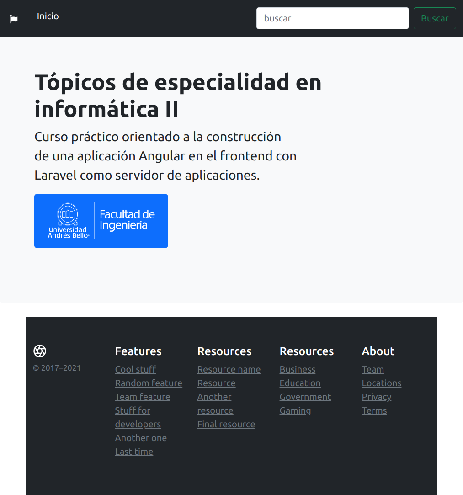

# Actividad 1.1: Buscar todas las opciones o propiedades que puede tener un componente y explicarlas.
- selector: permite registrar en la aplicación el componente con un nombre único para que pueda ser referenciado por el markup en otros componentes.
- templateUrl: identifica la template html que define el contenido del componente.
- styleUrls: permite asignar un estilo CSS a la plantilla.

**export** permite que los componentes puedan ser exportados para que sean utilizados por otros archivos de un proyecto.

- En la clase AppComponent puede cambiar una opción por defecto de la aplicación
llamada “title”, por lo que puedes probar cambiando el texto del título de la
aplicación para que una vez ejecutado se pueda visualizar el cambio. Por
ejemplo, al valor "titulo ad doc".


# Actividad N°1.2: Crear un nuevo proyecto, y dentro de él crear 3 componentes en total nuevos

```
ng new proyecto-prueba --prefix ng
```


Si no ocurre ningún error, al terminar vemos el mensaje de termino:


Ingresar al directorio creado por el comando **ng new**:

```
cd proyecto-prueba
```

Listamos los archivos para ver qué se creó:
```
ls -l
```


Crearemos los siguientes componentes:
- Barra de navegación: navbar
- Sección de pie de página: footer
- Encabezado de página: header

Primero, entramos al directorio src/app:

```
cd src/app
```

Ejecutar crear navbar:
```
ng g c navbar -is --flat
```


Ejecutar crear footer:
```
ng g c footer -is --flat
```


Ejecutar crear header:
```
ng g c header -is --flat
```


Luego revisamos cómo quedó el módulo app con los cambios hechos por la creación de los componentes:


Se ve que los tres componentes (Navbar, Footer y Header) se agregaron como declaraciones.

# Actividad N° 1.3: En cada componente insertar una imagen y un texto para visualizar (código HTML)

1. header

Tomamos código de ejemplo de getbootstrap.com y personalizamos:


2. footer


3. header - contenido de prueba


# Actividad N° 1.4: Agregar estos componentes a la página principal luego del título.


El resultado a continuación:



# Actividad N° 1.5: Crear una nueva aplicación seleccionando una tienda en línea y replicar al menos 3 segmentos utilizando componentes.